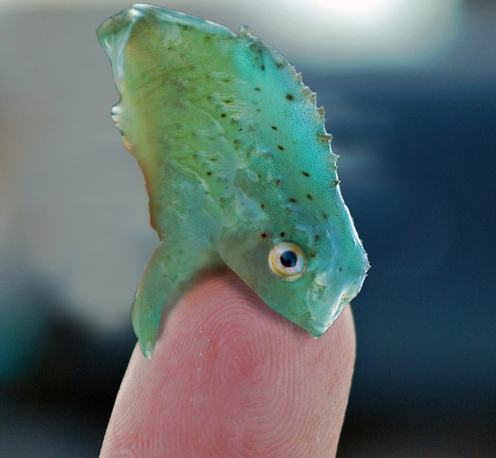

## Team Members:

- Alice Hua, [@alicehua11](https://github.com/alicehua11)
- Ellese Nguyen, [@Ellese](https://github.com/Ellese)

This assignment looks at Pacific Spiny Lumpsucker's habitat in open waters off the West Coast of North America based on the optimal sea surface temperatures and net primary productivity levels required for it to thrive. 
The purpose of this assignment is to find how these parameters are observed within the Marine Protected Area along the coast of California where this tiny fish can thrive.
We will then use the annual sea surface temperature from 2008-2012 and compare the resulting suitable habitat to the one derived from sea surface temperature in 2008, this is to compare the whether climate change has affected this fish's livelihood.

## Assignment
All work for this assignment is contained in the `assignment` directory.  The final write-up and all code is in the `.Rmd` notebook, and any rendered output files (`.md` and associated files) is in the `assignment` directory as well.

## Special files
All team repositories will also include most of the special files found here:

### Common files
- We have rasters and vector files stored under the rasters folder. There you will find raster data in .tif and .nc format. We have our vector data stored under shapefiles. These are the data we will be using in our analysis.
- `README.md` this file, a general overview of the repository in markdown format.  
- `.gitignore` Optional file, ignore common file types we don't want to accidentally commit to GitHub. Most projects should use this. 
- `spatial-template.Rproj` Optional, an R-Project file created by RStudio for it's own configuration.  Some people prefer to `.gitignore` this file.

### Infrastructure for Testing

- `.travis.yml`: A configuration file for automatically running [continuous integration](https://travis-ci.com) checks to verify reproducibility of all `.Rmd` notebooks in the repo.  If all `.Rmd` notebooks can render successfully, the "Build Status" badge above will be green (`build success`), otherwise it will be red (`build failure`).  
- `DESCRIPTION` a metadata file for the repository, based on the R package standard. It's main purpose here is as a place to list any additional R packages/libraries needed for any of the `.Rmd` files to run.
- `tests/render_rmds.R` an R script that is run to execute the above described tests, rendering all `.Rmd` notebooks. 

### This project is a part of our course on [Data Science for Global Change Ecology](https://espm-157.carlboettiger.info/):

