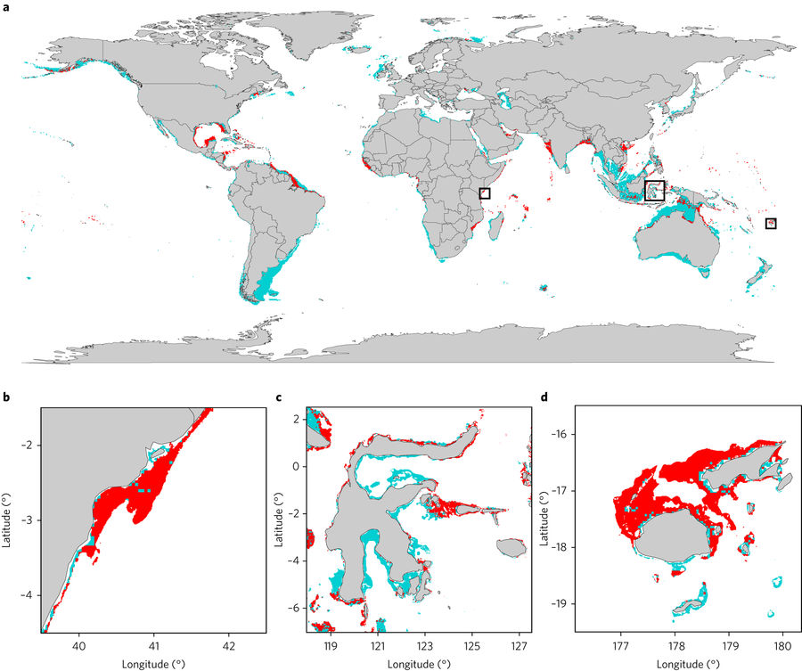
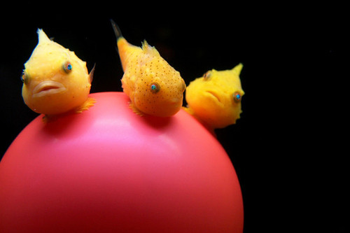

```{r setup, include=FALSE}
knitr::opts_chunk$set(messages = FALSE, cache = FALSE)
```

# Background Information

This module is inspired by a recent paper in Nature Ecology and Evolution, [**Mapping the global potential for marine aquaculture**](https://www.nature.com/articles/s41559-017-0257-9). The authors 
used multiple constraints including ship traffic, dissolved oxygen, bottom depth
and more, to limit and map areas suitable for aquaculture.



We are going to use a similar, but much more simplified approach here. 
We will map potential areas of marine aquaculture for the super cute Pacific spiny lumpsucker (*Eumicrotremus orbis*)



To do this we are going to need the following spatial data:  

**1. Sea Surface Temperature** (raster data)  
**2. Net Primary Productivity** (raster data)  
**3. Marine Protected Areas**  (vector data)  

```{r libraries, include= FALSE}
library(mapview)      #interactive maps, raster + vector layers
library(raster)       #Main raster library
library(tidyverse)    #our old friend
library(sf)           #to work with simple features data
library(dplyr)
library(mapdata)
library(ggmap)
library(maps)
library(ggplot2)
library(tmap)
library(grid)
library(rgdal)
library(ncdf4)
```  


So to figure out where we might find the lumpsucker fish, we need to know a little
about it!

From [NOAA's species description](http://www.nmfs.noaa.gov/speciesid/fish_page/fish68a.html):

> A lot of people who see Pacific spiny lumpsuckers for the first time describe them as a ping-pong ball with fins. They are tiny and very inefficient swimmers, found most often in kelp or eelgrass beds attached to a rock or a log no deeper than 500 feet. They are quite common, ranging from the waters off the Washington coast, up around the arc of the Aleutian Islands, to the Asian mainland and the northern islands of Japan, and in the Bering Sea. A giant Pacific spiny lumpsucker is five inches long, but most are closer to an inch. Scuba divers are their biggest fans because the little fellows will eat right out of their hands.

Key information for optimal growth:  

- Sea surface temperatures between **12 and 18 degrees Celsius**  
- Net Primary Productivity between **2.6 and 3 mgC/m2/day**
- Habitat within a marine protected area

### Creating a map which shows the acceptable habitat for the Spiny Lumpsucker!

Here we read in a map of the locations of Marine Protected Areas to find safe places for our Spiny friend to live!

```{r}
mpas <- sf::read_sf("shapefiles/mpas_westcoast.shp")
```

Here is a graph of the different Marine Protected agencies along the coast of California.

```{r}
mpas %>% 
  ggplot() + 
  geom_sf(aes(col=State))
```

We must import all the necessary data for our analysis. These include files containing the average annual sea surface temperature between 2008-2012, and the annual net primary productivity.

```{r}
npp <- raster("rasters/annual_npp.tif")
avg_2008 <- raster("rasters/average_annual_sst_2008.tif")
avg_2009 <- raster("rasters/average_annual_sst_2009.tif")
avg_2010 <- raster("rasters/average_annual_sst_2010.tif")
avg_2011 <- raster("rasters/average_annual_sst_2011.tif")
avg_2012 <- raster("rasters/average_annual_sst_2012.tif")
```
 
We are querying for the optimal parameters of the Lumpsucker's habitat as specified at the beginning. We do this by creating a rasterStack of the average sea surface temperatures, converting the units from Kelvin to Celcius, and then filtering the stack by the optimal temperature. We combine the stacks by taking a product of their values. This will return the areas that have been consistently suitable for the spiny lumpsucker between 2008-2012.

We perform a similar process with the net primary productivity information, but because there is only one dataset for net primary productivity, we simply filter by the optimal net primary productivity.

```{r}
# stacking our rasters into a rasterStack object for querying
aa_sst_stack <- stack(avg_2008, avg_2009, avg_2010, avg_2011, avg_2012)
filtered_stack <- aa_sst_stack - 273.15
filtered_stacker <- filtered_stack > 12 & filtered_stack < 18
filtered_stack_with_calc <- calc(filtered_stacker, fun=prod) 

# filter by habitable net primary productivity
npp_filtered <- npp < 3 & npp > 2.6
```

The coordinate reference system (CRS) of our net primary productivity raster needs to be reprojected to match our sea surface temperature CRS so that we may overlay them in the next steps.
```{r}
npp_crs <- crs(npp_filtered, asText=TRUE)
habit_temp_crs <- projectRaster(filtered_stack_with_calc, crs = npp_crs)
```

In this step we get a background map of the US for the purpose of overlaying our habitat raster data ontop. This extra step is for the sake of improving interpretability of our final visual map.

```{r}
states <- getData("GADM", country="USA", level=1) %>%
  st_as_sf() %>%
  st_transform(st_crs(mpas)) %>%
  st_simplify(dTolerance = 500)
```

Unfortunately our background map is too big for the purpose of our visualization. We can crop the US map to the bounding box of our sea surface temperature.

```{r}
# get bounding box for sst raster and crop states to have same bounding box
tmaptools::bb(filtered_stack_with_calc)
cropped_stat <- st_crop(states, xmin=-200.98475, ymin=19.99305, xmax=-90.98672, ymax= 59.98842)
```

Now we can visualize the locations with optimal sea surface temperature and net primary productivity, along with the overall map with temperature and net primary productivity combined. For our scope of analysis we are looking only at the West Coast of the United States.
Our last parameter for the optimal habitat of the Lumpsucker is containment within Marine Protected Areas (mpa). For this visualization, geographic points are categorized as 0 = unsuitable or 1 = suitable. The red regions are the perfect areas for our Lumpsuckers!

```{r}
# regions with optimal sst
map_temp <- tm_shape(habit_temp_crs) + tm_raster() +
  tm_shape(cropped_stat) + tm_polygons() +
  tm_shape(states) + tm_polygons() + 
  tm_layout(main.title = "Suitable Sea Surface Temperatures (SSN)", main.title.size = 1, legend.show = FALSE) 

# regions with optimal nnp
map_npp <- tm_shape(npp) + tm_raster() +
  tm_shape(cropped_stat) + tm_polygons() +
  tm_shape(states) + tm_polygons() + 
  tm_layout(main.title = "Net Primary Productivity (NPP)", main.title.size = 1) 

# regions with optimal sst and nnp
total_habit <- habit_temp_crs*npp_filtered
names(total_habit) <- "Optimal_SSN_and_NPP"
map_total <- tm_shape(total_habit) + tm_raster() +
  tm_shape(cropped_stat) + tm_polygons() +
  tm_shape(states) + tm_polygons() + 
  tm_layout(main.title = "Combined Temp & NPP", main.title.size = 1) 


# using mask(), convert vector mpas to raster to visualize overlayed areas with the raster data of sst and npp
masking_mpas <- mask(total_habit, mpas)

# region in the Marine Protected Area that Lumpersucker Fish can live in according to the temperature and npp
mpas_total <- tm_shape(masking_mpas) + tm_raster() +
  tm_shape(states) + tm_polygons() +
  tm_shape(mpas) + tm_borders() +
  tm_layout(main.title="Suitable Habitat within Marine Protected Areas", 
            main.title.size = .80, 
            bg.color = "skyblue")

tmap_arrange(map_temp, map_npp, map_total, mpas_total)
```

Since 2012, the sea has warmed up quite a lot due climate change (as we saw in our Climate Change module). We wanted to investigate how the sea surface temperatures for 2018 effects the span of the Lumpsucker's habitat for optimal growth. Here, we will look at the available data of ocean temperature (Jan-Dec of 2018) from [Nasa Earth Observation](https://neo.sci.gsfc.nasa.gov/view.php?datasetId=MYD28M&year=2018) (NEO).
```{r}
world_ocean_jan_2018 <- raster("rasters/jan_2018.nc")
world_ocean_feb_2018 <- raster("rasters/feb_2018.nc")
world_ocean_mar_2018 <- raster("rasters/mar_2018.nc")
world_ocean_apr_2018 <- raster("rasters/apr_2018.nc")
world_ocean_may_2018 <- raster("rasters/may_2018.nc")
world_ocean_june_2018 <- raster("rasters/june_2018.nc")
world_ocean_july_2018 <- raster("rasters/july_2018.nc")
world_ocean_aug_2018 <- raster("rasters/aug_2018.nc")
world_ocean_sept_2018 <- raster("rasters/sept_2018.nc")
world_ocean_oct_2018 <- raster("rasters/oct_2018.nc")
world_ocean_nov_2018 <- raster("rasters/nov_2018.nc")
world_ocean_dec_2018 <- raster("rasters/dec_2018.nc")

#Here is sea surface temperature in only Dec of 2018
world_ocean_jan_2018
plot(world_ocean_dec_2018) +
  title("World Ocean Temperatures December 2018")
```

We again query for the optimal temperature as we did with the 2008-2012 temperature data by creating a stack and filtering as to get the desired suitable habitats.

```{r}
# stacking rasters into a rasterStack object
sst_2018 <- stack(world_ocean_jan_2018, world_ocean_feb_2018, world_ocean_mar_2018, world_ocean_apr_2018, world_ocean_may_2018, world_ocean_june_2018, world_ocean_july_2018, world_ocean_aug_2018, world_ocean_sept_2018, world_ocean_oct_2018, world_ocean_nov_2018, world_ocean_dec_2018)

# cropping the world sst to our regional area.
tmaptools::bb(filtered_stack_with_calc)
cropped_sst_2018 <- crop(sst_2018, filtered_stack_with_calc)

# filtering for the optimal temperature for our fish
cropped_sst_convert <- cropped_sst_2018> 12 & cropped_sst_2018 < 18 
sst_2018_combine <- calc(cropped_sst_convert, fun=prod)
sst_2018_crs <- projectRaster(sst_2018_combine,  crs = npp_crs)
```

Now lets make a map showing where the Lumpsucker could live in 2018 off the West coast of U.S.
To see what most current habitable marine protected area in the U.S. West coast, we will be using the 2018 sea surface temperature (SST) and our previous raster for net primary productivity (NPP). It is important to note we are using the same NPP raster from our last 2008-2012 final map and that the area of suitable NPP levels has most likely changed due to climate change. For the sake of this exercise we are holding NPP constant for both maps while updating real time temperature changes.
Notice the much smaller optimal sea temperature surface and the combined net primary productivity surface as compared to our 2008-2012 maps. This is likely due to the increase in sea surface temperature from absorbing CO2, thus warming the water. Our fish can only thrive in water between 12 - 18 degree Celcius. Anything higher is too warm for our fish to live in. 

```{r}
# regions with optimal sst
map_2018 <- tm_shape(sst_2018_crs) + tm_raster() +
  tm_shape(cropped_stat) + tm_polygons() +
  tm_shape(states) + tm_polygons() +
  tm_layout(main.title = "Suitable Sea Temp Area 2018", main.title.size = 1, legend.show = FALSE) 

# convert crs of sst_2018_combine to npp_filtered
habit_2018_crs <- projectRaster(sst_2018_combine, crs = npp_crs)

# regions with optimal sst and nnp
total_habit_2018 <- habit_2018_crs*npp_filtered
names(total_habit_2018) <- "Optimal_SSN_and_NPP"
map_total_2018 <- tm_shape(total_habit_2018) +tm_raster() +
  tm_shape(cropped_stat) + tm_polygons() +
  tm_shape(states) + tm_polygons() + 
  tm_layout(main.title = "Combined Temp 2018 & NPP", main.title.size = 1) 

# using mask(), convert vector mpas to raster to visualize overlayed areas with the raster data of sst and npp
mpas_2018 <- mask(total_habit_2018, mpas)

# region in the Marine Protected Area containing optimal habitat for growth
mpas_total_2018 <- tm_shape(mpas_2018) + tm_raster() +
  tm_shape(states) + tm_polygons() +
  tm_shape(mpas) + tm_borders() +
  tm_layout(main.title="Suitable Habitat in MPAS 2018", 
            main.title.size = .80, 
            bg.color = "skyblue")

tmap_arrange(map_2018, map_npp, map_total_2018, mpas_total_2018)
```

### Final Conclusion

We are now finally able to compare the suitable habitat for the Lumpsucker between 2008-2012 and 2018. The unfortunate reality is that the suitable habitat has shrunk dramatically. Between 2008-2012, at least half of Marine Protected Areas provided optimal conditions for the Lumpsucker. By 2018, the habitat shrinks to just a few places off the coast of Northern California. We are also holding net primary productivity constant, so the differences between these graphs is only sea surface temperature. We expect that if we take into account the changes in net primary productivity off the West Coast of the U.S. that the area of suitable habitat would shrink. Unfortunately, this graph is most likely an optimistic estimate of where the Lumpsucker can comfortably live.

```{r}
tmap_arrange(mpas_total, mpas_total_2018)
```

