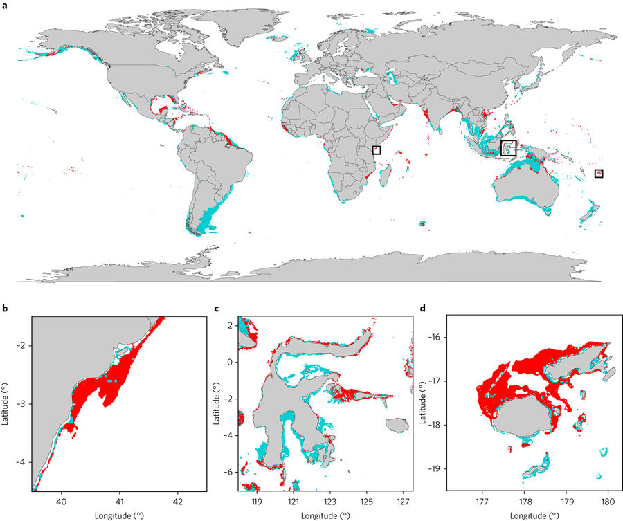
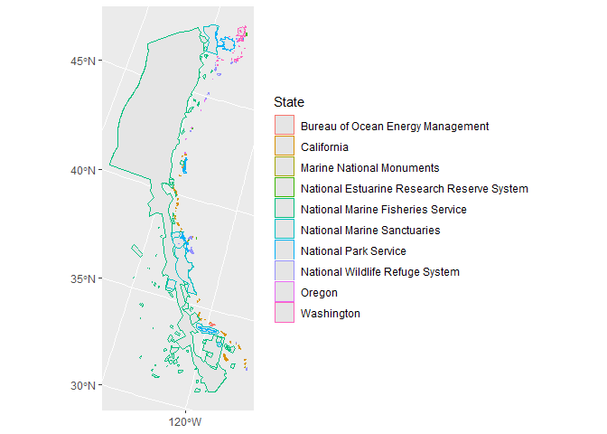
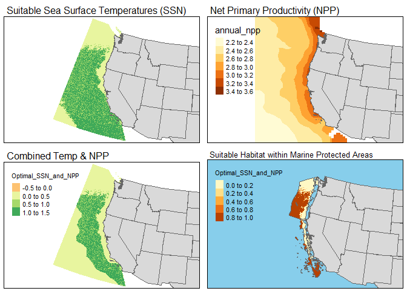
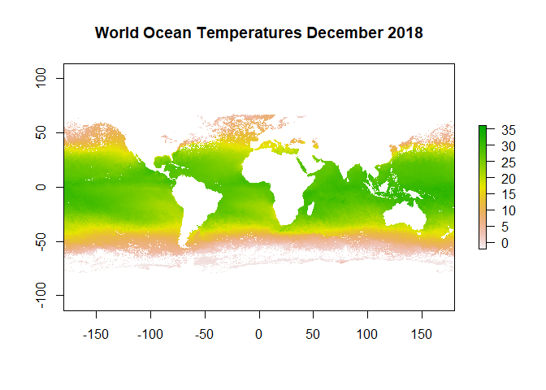
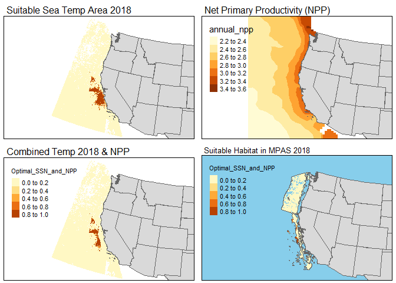
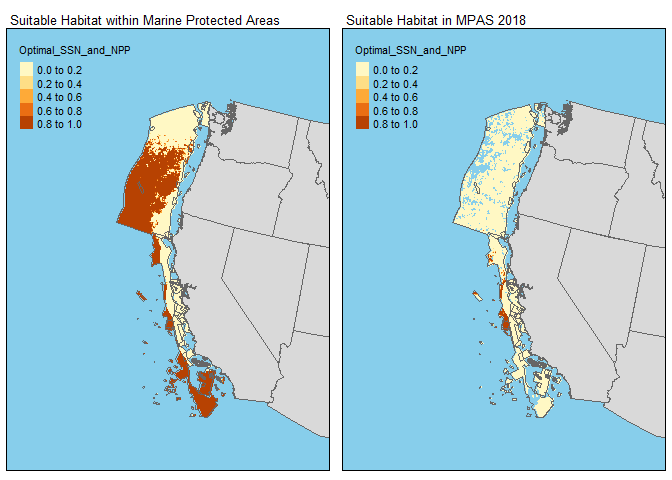

Habitat for the Spiny Lumpsucker
================
Dana Seidel (GSI)

# Background Information

This module is inspired by a recent paper in Nature Ecology and
Evolution, [**Mapping the global potential for marine
aquaculture**](https://www.nature.com/articles/s41559-017-0257-9). The
authors used multiple constraints including ship traffic, dissolved
oxygen, bottom depth and more, to limit and map areas suitable for
aquaculture.



We are going to use a similar, but much more simplified approach here.
We will map potential areas of marine aquaculture for the super cute
Pacific spiny lumpsucker (*Eumicrotremus orbis*)


To do this we are going to need the following spatial data:

**1. Sea Surface Temperature** (raster data)  
**2. Net Primary Productivity** (raster data)  
**3. Marine Protected Areas** (vector data)

So to figure out where we might find the lumpsucker fish, we need to
know a little about it\!

From [NOAA’s species
description](http://www.nmfs.noaa.gov/speciesid/fish_page/fish68a.html):

> A lot of people who see Pacific spiny lumpsuckers for the first time
> describe them as a ping-pong ball with fins. They are tiny and very
> inefficient swimmers, found most often in kelp or eelgrass beds
> attached to a rock or a log no deeper than 500 feet. They are quite
> common, ranging from the waters off the Washington coast, up around
> the arc of the Aleutian Islands, to the Asian mainland and the
> northern islands of Japan, and in the Bering Sea. A giant Pacific
> spiny lumpsucker is five inches long, but most are closer to an inch.
> Scuba divers are their biggest fans because the little fellows will
> eat right out of their hands.

Key information for optimal growth:

  - Sea surface temperatures between **12 and 18 degrees Celsius**  
  - Net Primary Productivity between **2.6 and 3 mgC/m2/day**
  - Habitat within a marine protected area

### Creating a map which shows the acceptable habitat for the Spiny Lumpsucker\!

Here we read in a map of the locations of Marine Protected Areas to find
safe places for our Spiny friend to live\!

``` r
mpas <- sf::read_sf("shapefiles/mpas_westcoast.shp")
```

Here is a graph of the different Marine Protected agencies along the
coast of California.

``` r
mpas %>% 
  ggplot() + 
  geom_sf(aes(col=State))
```

<!-- -->

We must import all the necessary data for our analysis. These include
files containing the average annual sea surface temperature between
2008-2012, and the annual net primary productivity.

``` r
npp <- raster("rasters/annual_npp.tif")
avg_2008 <- raster("rasters/average_annual_sst_2008.tif")
avg_2009 <- raster("rasters/average_annual_sst_2009.tif")
avg_2010 <- raster("rasters/average_annual_sst_2010.tif")
avg_2011 <- raster("rasters/average_annual_sst_2011.tif")
avg_2012 <- raster("rasters/average_annual_sst_2012.tif")
```

We are querying for the optimal parameters of the Lumpsucker’s habitat
as specified at the beginning. We do this by creating a rasterStack of
the average sea surface temperatures, converting the units from Kelvin
to Celcius, and then filtering the stack by the optimal temperature. We
combine the stacks by taking a product of their values. This will return
the areas that have been consistently suitable for the spiny lumpsucker
between 2008-2012.

We perform a similar process with the net primary productivity
information, but because there is only one dataset for net primary
productivity, we simply filter by the optimal net primary productivity.

``` r
# stacking our rasters into a rasterStack object for querying
aa_sst_stack <- stack(avg_2008, avg_2009, avg_2010, avg_2011, avg_2012)
filtered_stack <- aa_sst_stack - 273.15
filtered_stacker <- filtered_stack > 12 & filtered_stack < 18
filtered_stack_with_calc <- calc(filtered_stacker, fun=prod) 

# filter by habitable net primary productivity
npp_filtered <- npp < 3 & npp > 2.6
```

The coordinate reference system (CRS) of our net primary productivity
raster needs to be reprojected to match our sea surface temperature CRS
so that we may overlay them in the next steps.

``` r
npp_crs <- crs(npp_filtered, asText=TRUE)
habit_temp_crs <- projectRaster(filtered_stack_with_calc, crs = npp_crs)
```

In this step we get a background map of the US for the purpose of
overlaying our habitat raster data ontop. This extra step is for the
sake of improving interpretability of our final visual map.

``` r
states <- getData("GADM", country="USA", level=1) %>%
  st_as_sf() %>%
  st_transform(st_crs(mpas)) %>%
  st_simplify(dTolerance = 500)
```

Unfortunately our background map is too big for the purpose of our
visualization. We can crop the US map to the bounding box of our sea
surface temperature.

``` r
# get bounding box for sst raster and crop states to have same bounding box
tmaptools::bb(filtered_stack_with_calc)
```

    ##       xmin       ymin       xmax       ymax 
    ## -131.98475   29.99305 -114.98672   49.98842

``` r
cropped_stat <- st_crop(states, xmin=-200.98475, ymin=19.99305, xmax=-90.98672, ymax= 59.98842)
```

    ## Warning: attribute variables are assumed to be spatially constant
    ## throughout all geometries

Now we can visualize the locations with optimal sea surface temperature
and net primary productivity, along with the overall map with
temperature and net primary productivity combined. For our scope of
analysis we are looking only at the West Coast of the United States. Our
last parameter for the optimal habitat of the Lumpsucker is containment
within Marine Protected Areas (mpa). For this visualization, geographic
points are categorized as 0 = unsuitable or 1 = suitable. The red
regions are the perfect areas for our Lumpsuckers\!

``` r
# regions with optimal sst
map_temp <- tm_shape(habit_temp_crs) + tm_raster() +
  tm_shape(cropped_stat) + tm_polygons() +
  tm_shape(states) + tm_polygons() + 
  tm_layout(main.title = "Suitable Sea Surface Temperatures (SSN)", main.title.size = 1, legend.show = FALSE) 

# regions with optimal nnp
map_npp <- tm_shape(npp) + tm_raster() +
  
  tm_shape(cropped_stat) + tm_polygons() +
  tm_shape(states) + tm_polygons() + 
  tm_layout(main.title = "Net Primary Productivity (NPP)", main.title.size = 1) 

# regions with optimal sst and nnp
total_habit <- habit_temp_crs*npp_filtered
names(total_habit) <- "Optimal_SSN_and_NPP"
map_total <- tm_shape(total_habit) + tm_raster() +
  tm_shape(cropped_stat) + tm_polygons() +
  tm_shape(states) + tm_polygons() + 
  tm_layout(main.title = "Combined Temp & NPP", main.title.size = 1) 


# using mask(), convert vector mpas to raster to visualize overlayed areas with the raster data of sst and npp
masking_mpas <- mask(total_habit, mpas)

# region in the Marine Protected Area that Lumpersucker Fish can live in according to the temperature and npp
mpas_total <- tm_shape(masking_mpas) + tm_raster() +
  tm_shape(states) + tm_polygons() +
  tm_shape(mpas) + tm_borders() +
  tm_layout(main.title="Suitable Habitat within Marine Protected Areas", 
            main.title.size = .80, 
            bg.color = "skyblue")

tmap_arrange(map_temp, map_npp, map_total, mpas_total)
```

    ## Variable "layer" contains positive and negative values, so midpoint is set to 0. Set midpoint = NA to show the full spectrum of the color palette.

    ## Variable "Optimal_SSN_and_NPP" contains positive and negative values, so midpoint is set to 0. Set midpoint = NA to show the full spectrum of the color palette.

    ## Variable "layer" contains positive and negative values, so midpoint is set to 0. Set midpoint = NA to show the full spectrum of the color palette.

    ## Variable "Optimal_SSN_and_NPP" contains positive and negative values, so midpoint is set to 0. Set midpoint = NA to show the full spectrum of the color palette.

<!-- -->

Since 2012, the sea has warmed up quite a lot due climate change (as we
saw in our Climate Change module). We wanted to investigate how the sea
surface temperatures for 2018 effects the span of the Lumpsucker’s
habitat for optimal growth. Here, we will look at the available data of
ocean temperature (Jan-Dec of 2019) from [Nasa Earth
Observation](https://neo.sci.gsfc.nasa.gov/view.php?datasetId=MYD28M&year=2018)
(NEO).

``` r
world_ocean_jan_2018 <- raster("rasters/jan_2018.nc")
```

    ## Warning in .varName(nc, varname, warn = warn): varname used is: sst
    ## If that is not correct, you can set it to one of: sst, qual_sst, palette

``` r
world_ocean_feb_2018 <- raster("rasters/feb_2018.nc")
```

    ## Warning in .varName(nc, varname, warn = warn): varname used is: sst
    ## If that is not correct, you can set it to one of: sst, qual_sst, palette

``` r
world_ocean_mar_2018 <- raster("rasters/mar_2018.nc")
```

    ## Warning in .varName(nc, varname, warn = warn): varname used is: sst
    ## If that is not correct, you can set it to one of: sst, qual_sst, palette

``` r
world_ocean_apr_2018 <- raster("rasters/apr_2018.nc")
```

    ## Warning in .varName(nc, varname, warn = warn): varname used is: sst
    ## If that is not correct, you can set it to one of: sst, qual_sst, palette

``` r
world_ocean_may_2018 <- raster("rasters/may_2018.nc")
```

    ## Warning in .varName(nc, varname, warn = warn): varname used is: sst
    ## If that is not correct, you can set it to one of: sst, qual_sst, palette

``` r
world_ocean_june_2018 <- raster("rasters/june_2018.nc")
```

    ## Warning in .varName(nc, varname, warn = warn): varname used is: sst
    ## If that is not correct, you can set it to one of: sst, qual_sst, palette

``` r
world_ocean_july_2018 <- raster("rasters/july_2018.nc")
```

    ## Warning in .varName(nc, varname, warn = warn): varname used is: sst
    ## If that is not correct, you can set it to one of: sst, qual_sst, palette

``` r
world_ocean_aug_2018 <- raster("rasters/aug_2018.nc")
```

    ## Warning in .varName(nc, varname, warn = warn): varname used is: sst
    ## If that is not correct, you can set it to one of: sst, qual_sst, palette

``` r
world_ocean_sept_2018 <- raster("rasters/sept_2018.nc")
```

    ## Warning in .varName(nc, varname, warn = warn): varname used is: sst
    ## If that is not correct, you can set it to one of: sst, qual_sst, palette

``` r
world_ocean_oct_2018 <- raster("rasters/oct_2018.nc")
```

    ## Warning in .varName(nc, varname, warn = warn): varname used is: sst
    ## If that is not correct, you can set it to one of: sst, qual_sst, palette

``` r
world_ocean_nov_2018 <- raster("rasters/nov_2018.nc")
```

    ## Warning in .varName(nc, varname, warn = warn): varname used is: sst
    ## If that is not correct, you can set it to one of: sst, qual_sst, palette

``` r
world_ocean_dec_2018 <- raster("rasters/dec_2018.nc")
```

    ## Warning in .varName(nc, varname, warn = warn): varname used is: sst
    ## If that is not correct, you can set it to one of: sst, qual_sst, palette

``` r
#Here is sea surface temperature in only Dec of 2018
world_ocean_jan_2018
```

    ## class      : RasterLayer 
    ## dimensions : 4320, 8640, 37324800  (nrow, ncol, ncell)
    ## resolution : 0.04166667, 0.04166667  (x, y)
    ## extent     : -180, 180, -90.00001, 90  (xmin, xmax, ymin, ymax)
    ## crs        : +proj=longlat +datum=WGS84 +ellps=WGS84 +towgs84=0,0,0 
    ## source     : C:/Users/elles/Documents/College/FA_2019/ESPM157/spatial-hua-nguyen/spatial/rasters/jan_2018.nc 
    ## names      : Sea.Surface.Temperature 
    ## zvar       : sst

``` r
plot(world_ocean_dec_2018) +
  title("World Ocean Temperatures December 2018")
```

<!-- -->

    ## integer(0)

We again query for the optimal temperature as we did with the 2008-2012
temperature data by creating a stack and filtering as to get the desired
suitable habitats.

``` r
# stacking rasters into a rasterStack object
sst_2018 <- stack(world_ocean_jan_2018, world_ocean_feb_2018, world_ocean_mar_2018, world_ocean_apr_2018, world_ocean_may_2018, world_ocean_june_2018, world_ocean_july_2018, world_ocean_aug_2018, world_ocean_sept_2018, world_ocean_oct_2018, world_ocean_nov_2018, world_ocean_dec_2018)

# cropping the world sst to our regional area.
tmaptools::bb(filtered_stack_with_calc)
```

    ##       xmin       ymin       xmax       ymax 
    ## -131.98475   29.99305 -114.98672   49.98842

``` r
cropped_sst_2018 <- crop(sst_2018, filtered_stack_with_calc)

# filtering for the optimal temperature for our fish
cropped_sst_convert <- cropped_sst_2018> 12 & cropped_sst_2018 < 18 
sst_2018_combine <- calc(cropped_sst_convert, fun=prod)
sst_2018_crs <- projectRaster(sst_2018_combine,  crs = npp_crs)
```

Now lets make a map showing where the Lumpsucker could live in 2018 off
the West coast of U.S. To see what most current habitable marine
protected area in the U.S. West coast, we will be using the 2018 sea
surface temperature (SST) and our previous raster for net primary
productivity (NPP). It is important to note we are using the same NPP
raster from our last 2008-2012 final map and that the area of suitable
NPP levels has most likely changed due to climate change. For the sake
of this exercise we are holding NPP constant for both maps while
updating real time temperature changes.

``` r
# regions with optimal sst
map_2018 <- tm_shape(sst_2018_crs) + tm_raster() +
  tm_shape(cropped_stat) + tm_polygons() +
  tm_shape(states) + tm_polygons() +
  tm_layout(main.title = "Suitable Sea Temp Area 2018", main.title.size = 1, legend.show = FALSE) 

# convert crs of sst_2018_combine to npp_filtered
habit_2018_crs <- projectRaster(sst_2018_combine, crs = npp_crs)

# regions with optimal sst and nnp
total_habit_2018 <- habit_2018_crs*npp_filtered
```

    ## Warning in habit_2018_crs * npp_filtered: Raster objects have different
    ## extents. Result for their intersection is returned

``` r
names(total_habit_2018) <- "Optimal_SSN_and_NPP"
map_total_2018 <- tm_shape(total_habit_2018) +tm_raster() +
  tm_shape(cropped_stat) + tm_polygons() +
  tm_shape(states) + tm_polygons() + 
  tm_layout(main.title = "Combined Temp 2018 & NPP", main.title.size = 1) 

# using mask(), convert vector mpas to raster to visualize overlayed areas with the raster data of sst and npp
mpas_2018 <- mask(total_habit_2018, mpas)

# region in the Marine Protected Area containing optimal habitat for growth
mpas_total_2018 <- tm_shape(mpas_2018) + tm_raster() +
  tm_shape(states) + tm_polygons() +
  tm_shape(mpas) + tm_borders() +
  tm_layout(main.title="Suitable Habitat in MPAS 2018", 
            main.title.size = .80, 
            bg.color = "skyblue")

tmap_arrange(map_2018, map_npp, map_total_2018, mpas_total_2018)
```

<!-- -->

### Final Conclusion

We are now finally able to compare the suitable habitat for the
Lumpsucker between 2008-2012 and 2018. The unfortunate reality is that
the suitable habitat has shrunk dramatically. Between 2008-2012, at
least half of Marine Protected Areas provided optimal conditions for the
Lumpsucker. By 2018, the habitat shrinks to just a few places off the
coast of Northern California. We are also holding net primary
productivity constant, so the differences between these graphs is only
sea surface temperature. We expect that if we take into account the
changes in net primary productivity off the West Coast of the U.S. that
the area of suitable habitat would shrink. Unfortunately, this graph is
most likely an optimistic estimate of where the Lumpsucker can
comfortably live.

``` r
tmap_arrange(mpas_total, mpas_total_2018)
```

<!-- -->
